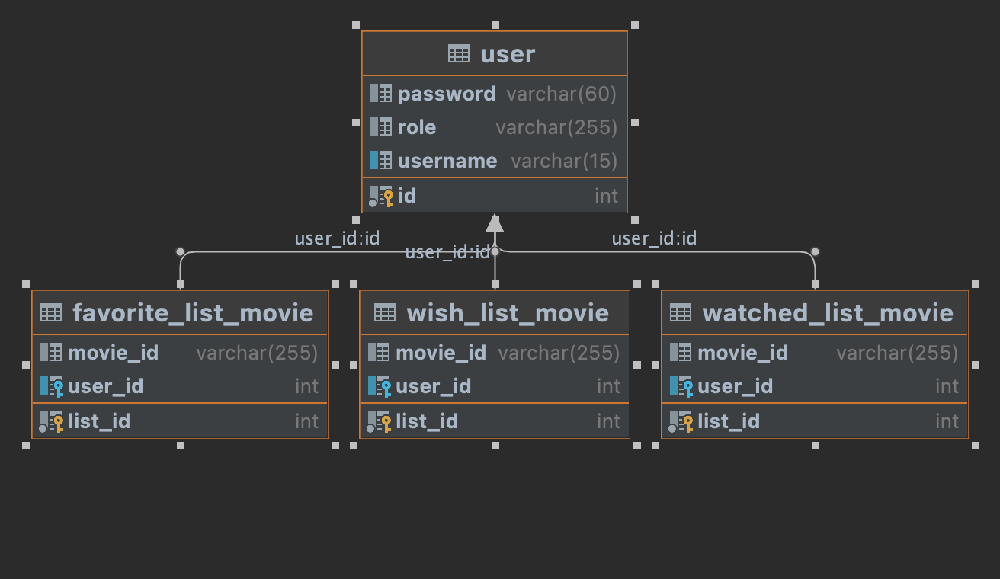
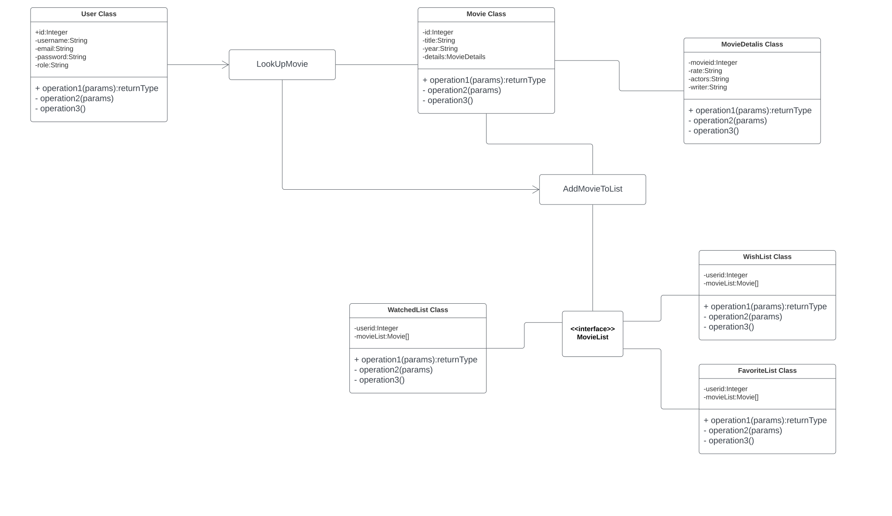

# MoviePal

# Store And Manage All Your Movie Lists In One Place!

------------

# Features

- Scalability
- Security
- Handling API and user errors 
- The First Version Comes With Three Lists
- 
   1 . Watch List
- 
   2 . Favorite  List
- 
   3 . Wish List

# Used Api (Omdbapi)
find more by visiting their website
www.omdbapi.com
   
# Data Class Diagram 

# Flow

# Herokuapp Links

Register using  - `<POST>` : <https://moviepal1.herokuapp.com/user/register>

Find a movie using its name - `<GET>` : <https://moviepal1.herokuapp.com/movie/lookby/name/{movie-name}>

Find a movie using its id - `<GET>` : <https://moviepal1.herokuapp.com/movie/lookby/id/{movie-name}>

Search for movies using the name - `<GET>` : <https://moviepal1.herokuapp.com/movie/lookby/search/name/{movie-name}>

Add movie to your wish list using the name  - `<POST>` : <https://moviepal1.herokuapp.com/movie/add/name/wishlist/{movie-name}>

Add movie to your favorite list using the name  - `<POST>` : <https://moviepal1.herokuapp.com/movie/add/name/favorite-list/{movie-name}>

Add movie to your watched list using the name  - `<POST>` : <https://moviepal1.herokuapp.com/movie/add/name/watched-list/{movie-name}>

Remove movie to your wish list using the name  - `<DELETE>` : <https://moviepal1.herokuapp.com/movie/remove/name/wishlist/{movie-name}>

Remove movie to your favorite list using the name  - `<DELETE>` : <https://moviepal1.herokuapp.com/movie/remove/name/favorite-list/{movie-name}>

Remove movie to your watched list using the name  - `<DELETE>` : <https://moviepal1.herokuapp.com/movie/remove/name/watched-list/{movie-name}>

To show all movie in a wish list
`<GET>` : <https://moviepal1.herokuapp.com/user/wishlist>

To show all movie in a favorite list
`<GET>` : <https://moviepal1.herokuapp.com/user/favorite-list>

To show all movie in a watched list
`<GET>` : <https://moviepal1.herokuapp.com/user/watched-list>

